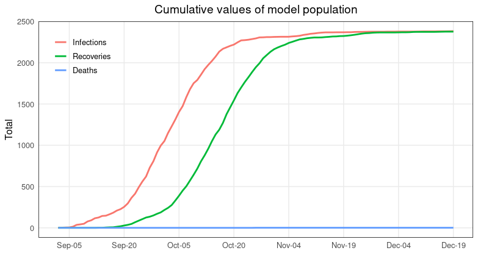
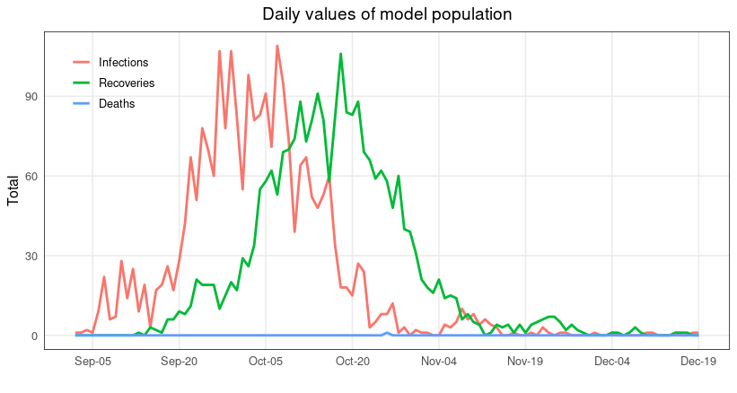

# Simulation results

This directory contains results of running four simulations:

* *no_intervention* - baseline simulation
* *classrooms* - social distancing and classroom masks intervention
* *household* - in addition to the *classroom* intervention, reducing the size of a household
* *testing* - in addition to the previous interventions, implementing regular testing
* *tracing* - in addition to the above intervention, implementing tracing 

Each subdirectory contains a png file from Covasim output and seven csv files. sim_results_{simulation_name}.csv files contain the data used by R scripts to generate images to compare various interventions.

